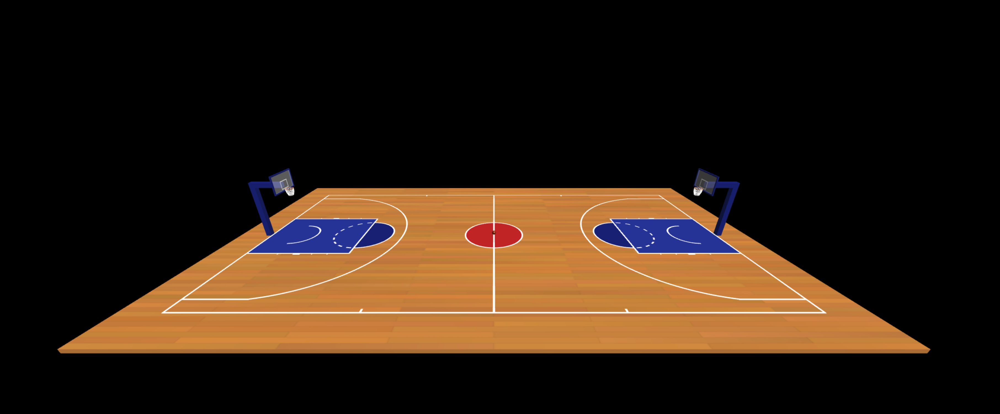
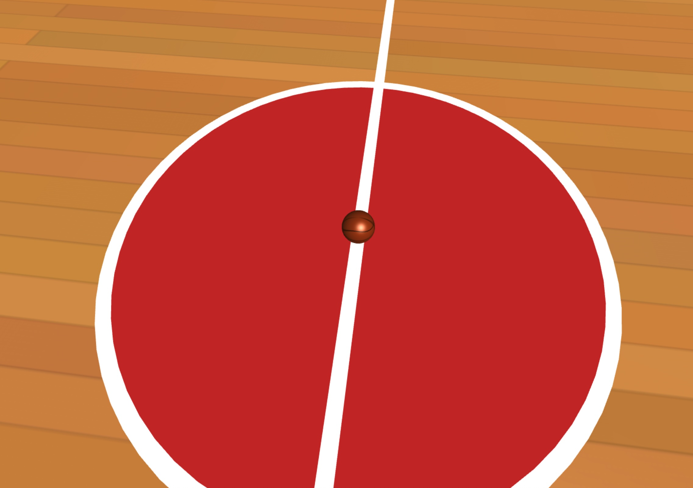
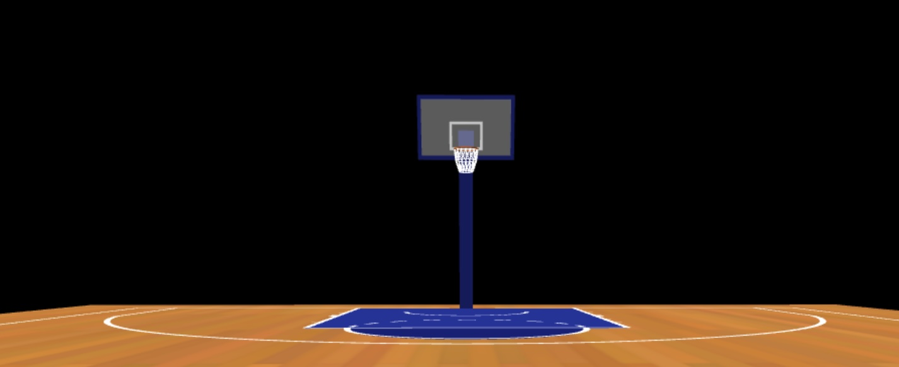
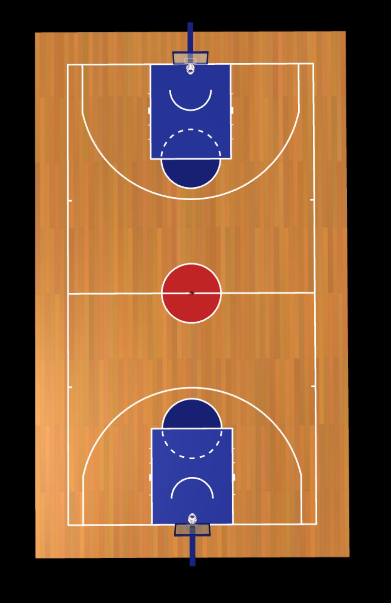

# Computer Graphics - Exercise 5 - WebGL Basketball Court

## Getting Started
1. Clone this repository to your local machine
2. Make sure you have Node.js installed
3. Start the local web server: `node index.js`
4. Open your browser and go to http://localhost:8000

## Complete Instructions
**All detailed instructions, requirements, and specifications can be found in:**
`basketball_exercise_instructions.html`

## Group Members
**MANDATORY: Add the full names of all group members here:**
- Gal Rabinovitz - 21188284
- Aviad Kariv - 319001996

## Technical Details
- Run the server with: `node index.js`
- Access at http://localhost:8000 in your web browser

## Implemented Controls
- The game implements arrow keys for moving the basketball around the court, W/S keys for adjusting shot power (0-100%), and spacebar for shooting the ball toward the nearest hoop with automatic targeting. Additional controls include R for resetting the ball position and clearing combos, and O for toggling orbit camera mode to change viewing perspectives.

## Description of physics system implementation
- Realistic Projectile Motion: Ball follows gravity-based trajectory with initial velocity calculated from shot power and direction to the nearest hoop

- Advanced Collision Detection: Uses Three.js bounding boxes and sphere intersections for backboards/arms, plus specialized torus collision for rim interactions with bounce physics

- Surface-Specific Bouncing: Different bounciness coefficients (rim: 0.8, court: 0.7) with spin effects on rim bounces based on approach angle

- Smart Scoring System: Detects swish shots (no rim contact) vs regular shots, implements combo multipliers for consecutive makes, and automatically resets on missed shots or out-of-bounds

## Bonus Features Implemented
- **Multiple Hoops:** Allow shooting at both hoops with automatic targeting
- **Swish Detection:** Bonus points for shots that don't touch the rim
- **Combo System:** Consecutive shots award bonus points

## Short Video
[Watch the short gameplay video here](https://youtu.be/rjyyMlaae7k)

## Screenshots

